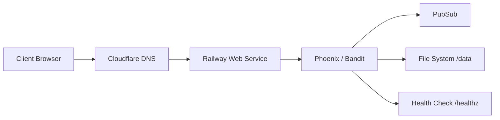

# Voice BBS

Realtime voice bulletin board. Hold to record → encoded as PNG pixels → stream playback.

Live: https://bubblevoice.up.railway.app

---

## Architecture



## Tech Stack

| Component | Choice | Reason |
|-----------|--------|--------|
| Runtime | Elixir 1.17 + Phoenix 1.7 | Concurrency model fits real-time audio broadcast |
| Transport | Phoenix LiveView + PubSub | Server-push without WebSocket client complexity |
| Storage | Filesystem (`/data/uploads`) | Audio-as-PNG experiment; volume mounted on Railway |
| Hosting | Railway (Docker) | Zero-config deploy for Elixir containers |
| DNS | Cloudflare | DNS management + future SSL/CDN |
| Monitoring | UptimeRobot | 5-min ping to `/healthz` (cold-start mitigation) |

## Deployment

```bash
# Docker multi-stage build
fly deploy
# or Railway auto-deploy on push to master
```

- Dockerfile: multi-stage (`builder` → `debian:bookworm-slim`)
- Volume: `/data` mounted for persistent uploads (`UPLOADS_DIR=/data/uploads`)
- SSL: Disabled for internal Railway DB (`RAILWAY_SERVICE_ID` detected)
- Migrations: Manual via `POST /api/migrate` after deploy

## Operations

- **Health:** `GET /healthz` — UptimeRobot pings every 5 minutes
- **Cold start:** ~15s on free tier (mitigated by keep-alive ping)
- **Logs:** Railway dashboard + `fly logs`
- **Backups:** Filesystem volume on Railway (ephemeral on free tier — known limitation)

## Data Flow

```
Hold to Record
  → MediaRecorder (Opus 32kbps, WebM)
    → decode → trim silence (RMS)
      → encode as PNG pixels (Canvas)
        → POST /api/upload (base64)
          → GenServer saves PNG + PubSub broadcast
            → LiveView stream_insert (real-time)
              → tap bubble → decode PNG → play audio
```

## API Endpoints

| Method | Path | Description |
|--------|------|-------------|
| GET | /api/posts | All posts JSON |
| GET | /api/tree | Tree: rooms + sources |
| POST | /api/upload | Upload audio (base64 PNG) |
| POST | /api/migrate | Run DB migrations |
| GET | /healthz | Health check |

## Known Limitations

| Issue | Impact | Mitigation |
|-------|--------|------------|
| Free-tier cold start | ~15s initial load | UptimeRobot keep-alive ping |
| Ephemeral filesystem | Uploads lost on redeploy without volume | Volume mounted at `/data` |
| Manual migrations | Post-deploy DB update | `POST /api/migrate` endpoint |
| No auth on admin | Anyone can delete posts | Intentional for demo; add auth for production |

## Local Development

```bash
mix deps.get && mix setup
mix phx.server
# → http://localhost:4000
```

## Why This Architecture

Built as an experiment in **encoding arbitrary binary (Opus audio) as PNG pixels** for storage simplicity. The architecture prioritizes:

1. **Operational simplicity** — single container, no external DB dependency in core flow
2. **Real-time without complexity** — Phoenix PubSub over raw WebSocket management
3. **Deployability** — Docker + Railway/Fly for immediate production equivalence

---

*Built with Elixir, curiosity, and the belief that infrastructure should be as observable as a building's strut.*
